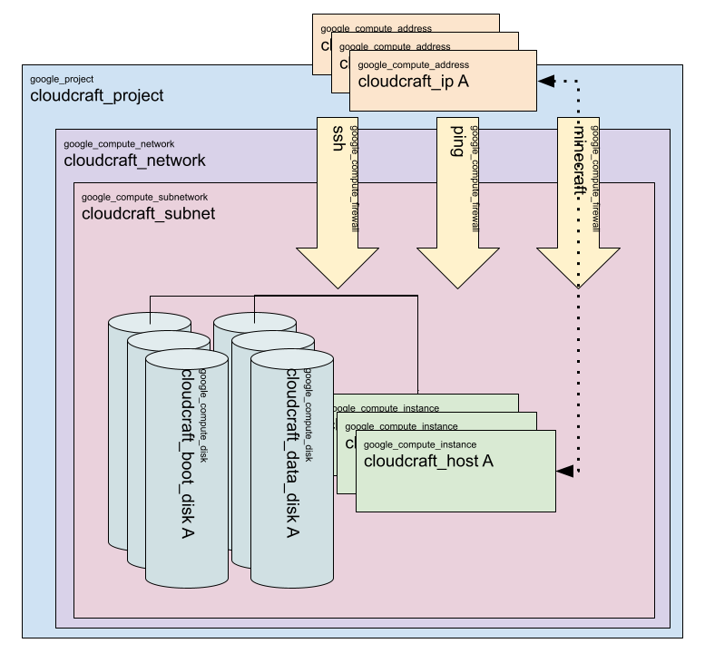

# Cloudcraft Terraform Reference : root module

This root module creates a Google Project and shared network resources. Machine instances and their accompanying disks and IP addresses are generated in the [vm-instance module](./modules/vm-instance/README.md)

## Requirements

| Name | Version |
|------|---------|
|  [google](#requirement\_google) | >= 4.27.0 |

## Providers

| Name | Version |
|------|---------|
|  [google](#provider\_google) | 5.8.0 |
|  [random](#provider\_random) | 3.6.0 |

## Modules

| Name | Source | Version |
|------|--------|---------|
|  [vm\_instance](./modules/vm-instance/README.md) | ./modules/vm-instance | n/a |

## Resources

| Name | Type |
|------|------|
| [google_compute_firewall.cloudcraft_service](https://registry.terraform.io/providers/hashicorp/google/latest/docs/resources/compute_firewall) | resource |
| [google_compute_firewall.ping](https://registry.terraform.io/providers/hashicorp/google/latest/docs/resources/compute_firewall) | resource |
| [google_compute_firewall.ssh](https://registry.terraform.io/providers/hashicorp/google/latest/docs/resources/compute_firewall) | resource |
| [google_compute_network.cloudcraft_network](https://registry.terraform.io/providers/hashicorp/google/latest/docs/resources/compute_network) | resource |
| [google_compute_subnetwork.cloudcraft_subnet](https://registry.terraform.io/providers/hashicorp/google/latest/docs/resources/compute_subnetwork) | resource |
| [google_project.cloudcraft-project](https://registry.terraform.io/providers/hashicorp/google/latest/docs/resources/project) | resource |
| [google_project_iam_custom_role.cloudcraft_switcher](https://registry.terraform.io/providers/hashicorp/google/latest/docs/resources/project_iam_custom_role) | resource |
| [google_project_iam_custom_role.instance_lister](https://registry.terraform.io/providers/hashicorp/google/latest/docs/resources/project_iam_custom_role) | resource |
| [google_project_service.compute_api](https://registry.terraform.io/providers/hashicorp/google/latest/docs/resources/project_service) | resource |
| [google_service_account.cloudcraft_service_acct](https://registry.terraform.io/providers/hashicorp/google/latest/docs/resources/service_account) | resource |
| [random_id.project_id](https://registry.terraform.io/providers/hashicorp/random/latest/docs/resources/id) | resource |

## Inputs

| Name | Description | Type | Default | Required |
|------|-------------|------|---------|:--------:|
|  [billing\_account\_id](#input\_billing\_account\_id) | ID of the billing account to use for the project. | `string` | n/a | yes |
|  [network\_name](#input\_network\_name) | The name of the network the server resides in. | `string` | `"cloudcraft-network"` | no |
|  [org\_id](#input\_org\_id) | The name of hosting organization's ID. | `any` | n/a | yes |
|  [region](#input\_region) | The region where to build the project. | `string` | `"us-central1"` | no |
|  [server\_type](#input\_server\_type) | Takes 'java' or 'bedrock'. | `string` | `"bedrock"` | no |
|  [servers](#input\_servers) | A map of the server configurations. | <pre>map(   object({     server_memory = optional(string)     data_disk_size = optional(string)     host_image = optional(string)     internal_ip = string     machine_type = optional(string),     server_type = optional(string)   }) )</pre> | n/a | yes |
|  [vm\_managers](#input\_vm\_managers) | Name of group with permisions to activate and deactivate the server. | `string` | `"cloudcraft-users"` | no |
|  [zone](#input\_zone) | The zone where to build the project. | `string` | `"us-central1-c"` | no |

## Outputs

| Name | Description |
|------|-------------|
|  [project\_id](#output\_project\_id) | The project ID. |
|  [servers](#output\_servers) | The information on each of the servers. |
